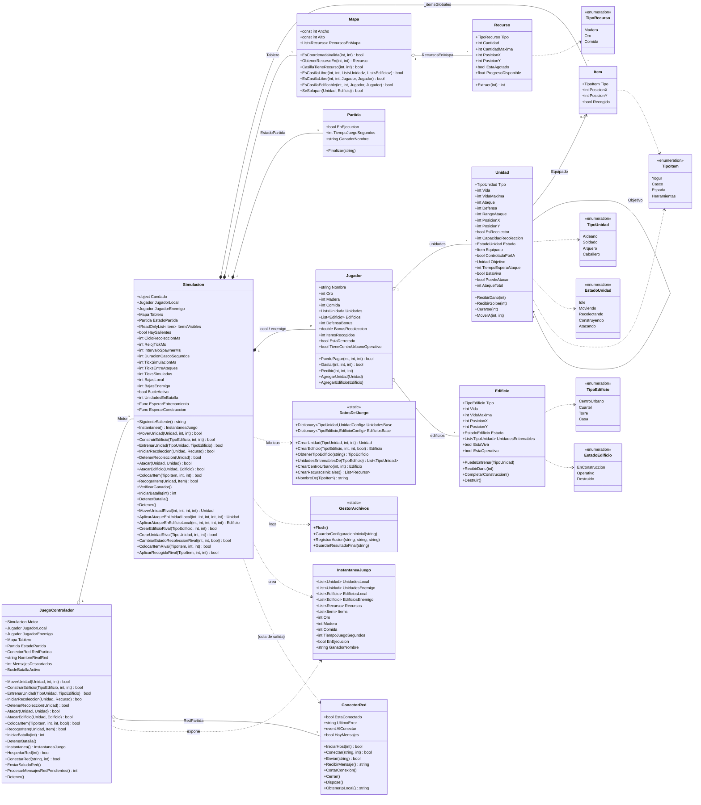
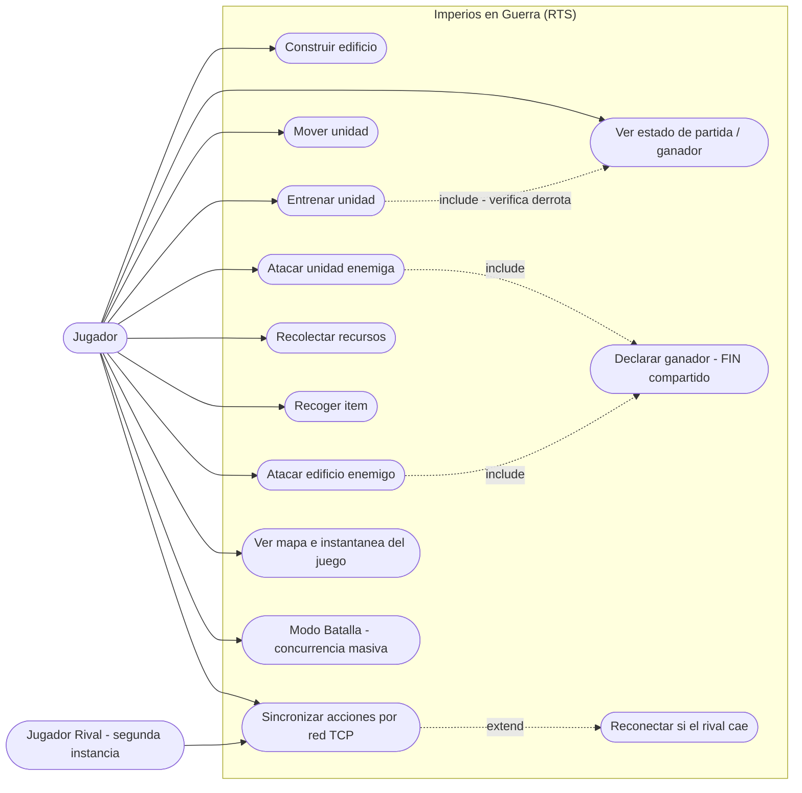
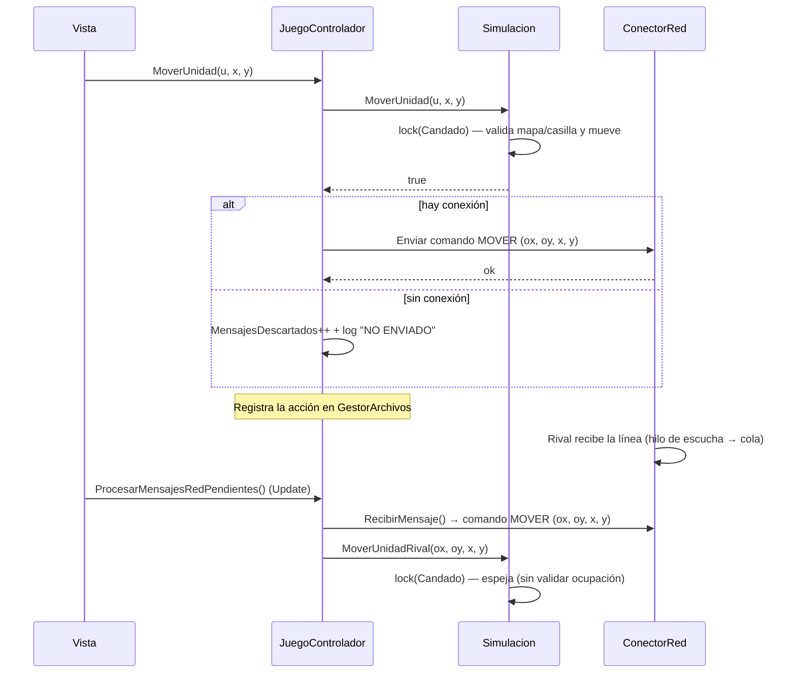
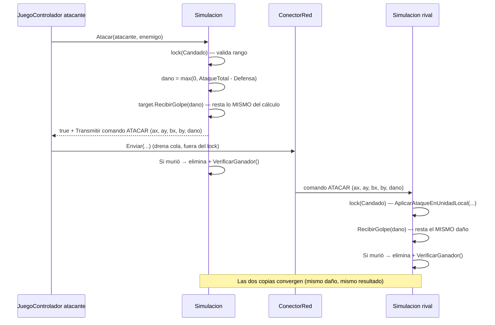
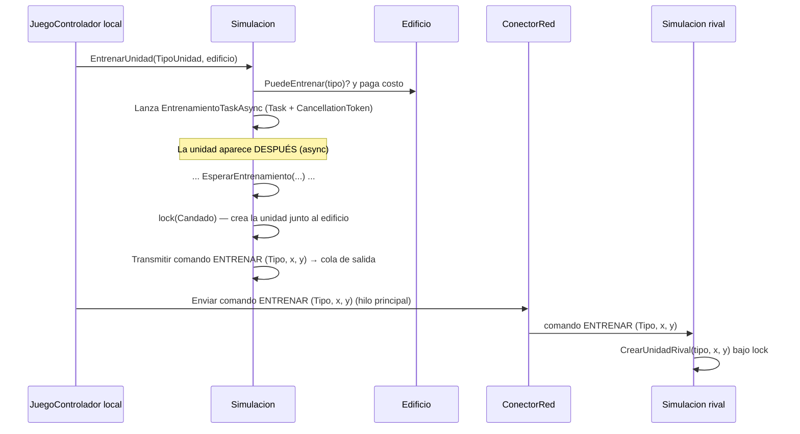
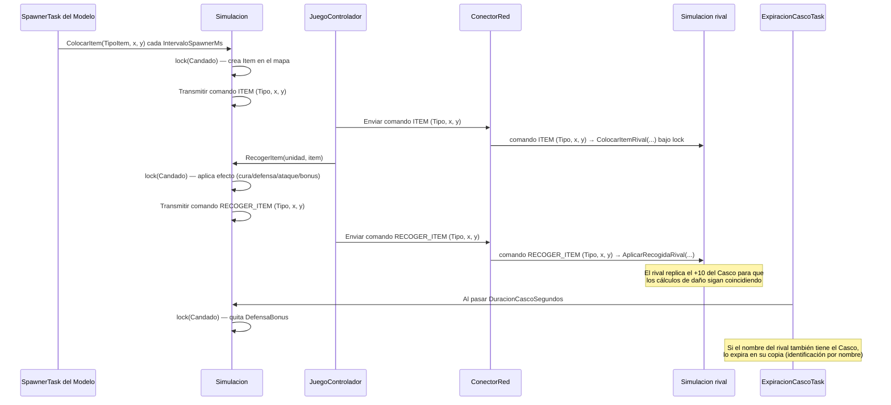
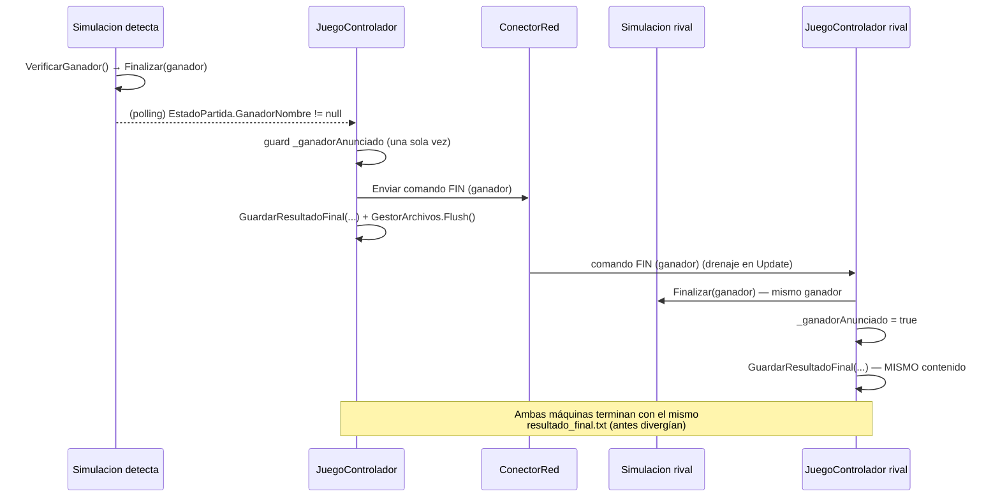
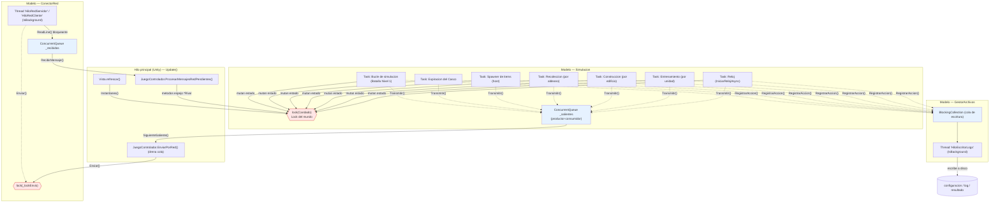
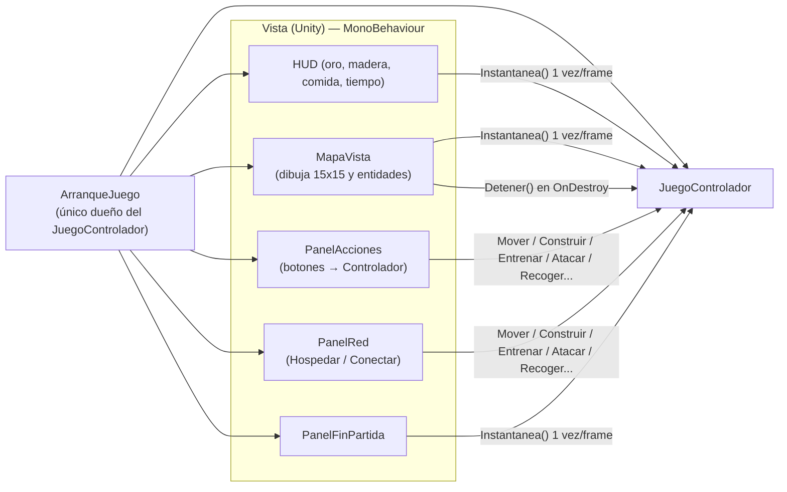

# DOCUMENTACIÓN TÉCNICA — "Imperios en Guerra" (RTS en Unity)

<style>
  @page { margin: 10mm 12mm; }
  body { font-family: "Segoe UI", system-ui, sans-serif; line-height: 1.5; }
  h1, h2, h3, h4 { line-height: 1.25; }
  pre { background: #f6f8fa; border: 1px solid #d0d7de; border-radius: 6px; padding: 10px 12px; overflow-x: auto; }
  code { background: #f6f8fa; border-radius: 4px; padding: 1px 5px; }
  pre code { background: none; padding: 0; }
  table { border-collapse: collapse; }
  th, td { border: 1px solid #d0d7de; padding: 6px 10px; }
  th { background: #f6f8fa; }
  @media print {
    body { font-size: 11pt; line-height: 1.35; }
    p, li { margin: 3px 0; }
    h1 { margin: 0 0 8px; }
    h2 { margin: 14px 0 6px; }
    h3 { margin: 10px 0 4px; }
    h1, h2, h3, h4 { break-after: avoid; page-break-after: avoid; }
    pre, table, img { margin: 5px 0; break-inside: avoid; page-break-inside: avoid; }
    .mermaid, svg { max-width: 100% !important; height: auto; page-break-inside: avoid; margin: 6px 0 !important; }
  }
</style>

Diagramas de diseño del sistema. Reflejan el estado del Modelo congelado en el tag `modelo-1.0.0` (ramas `modelo` / `main`).

Los bloques `mermaid` se ven en GitHub, en VS Code (extensión Mermaid) o en https://mermaid.live. Los bloques `plantuml` se renderizan en https://www.plantuml.com/plantuml o con la extensión PlantUML.

Idea central de la arquitectura (MVC):

- **Modelo** = toda la simulación y **toda la concurrencia** (hilos, locks, colas). Sin `UnityEngine`, por eso se prueba fuera de Unity.
- **Controlador** = puente delgado: traduce acciones de la Vista → Modelo, traduce la red → Modelo, y anuncia/carga logs. **No crea hilos.**
- **Vista** = solo pinta desde una instantánea y llama al Controlador.

---

## 1. Diagrama de clases



**Nota sobre `JuegoControlador.Motor`:** es `public` a propósito. Las pruebas de escritorio (fuera de Unity) necesitan ajustar los tiempos del motor (`CicloRecoleccionMs`, `EsperarEntrenamiento`, etc.) y consultar contadores de batalla. Envolverlo fue una mejora evaluada y descartada por romper esas suites; queda documentado como decisión.

---

## 2. Diagrama de casos de uso

Nota: los casos de uso no son un tipo nativo de Mermaid. Van dos versiones: la de Mermaid (renderiza en GitHub/VS Code) y la de PlantUML (notación UML formal; se pega en https://www.plantuml.com/plantuml).

### 2.1 Versión Mermaid (renderiza en GitHub)



### 2.2 Versión formal PlantUML (texto para pegar en plantuml.com)

```text
@startuml
left to right direction
skinparam packageStyle rectangle

actor "Jugador" as J
actor "Jugador Rival\n(segunda instancia)" as R

rectangle "Imperios en Guerra (RTS)" {
  usecase "Construir edificio" as UC02
  usecase "Entrenar unidad" as UC03
  usecase "Mover unidad" as UC05
  usecase "Atacar unidad enemiga" as UC06
  usecase "Atacar edificio enemigo" as UC07
  usecase "Recolectar recursos" as UC08
  usecase "Recoger item" as UC09
  usecase "Sincronizar acciones\npor red (TCP)" as UC04
  usecase "Ver mapa e\ninstantánea del juego" as UC11
  usecase "Ver estado de\npartida / ganador" as UC12
  usecase "Declarar ganador\n(FIN compartido)" as UC19
  usecase "Expulsar/Reconectar\nsi el rival cae" as UC17
  usecase "Modo Batalla\n(concurrencia masiva)" as UC18
}

J --> UC02
J --> UC03
J --> UC05
J --> UC06
J --> UC07
J --> UC08
J --> UC09
J --> UC11
J --> UC12
J --> UC18
J --> UC04
R --> UC04
UC04 ..> UC17 : <<extend>>
UC03 ..> UC12 : <<include>> (verifica derrota)
UC06 ..> UC19 : <<include>>
UC07 ..> UC19 : <<include>>
@enduml
```

---

## 3. Diagramas de secuencia

Formato del protocolo: para que rendericen en cualquier visor, en los diagramas el comando se representa como `NOMBRE (campos)`. En el protocolo real (ver `ConectorRed.cs`) los campos van separados por `;`: `MOVER;<ox>;<oy>;<x>;<y>`, `ATACAR;<ax>;<ay>;<bx>;<by>;<dano>`, `ATACAR_EDIFICIO;<ax>;<ay>;<ex>;<ey>;<ataque>`, `CONSTRUIR;<Tipo>;<x>;<y>`, `ENTRENAR;<Tipo>;<x>;<y>`, `RECOLECTAR;<x>;<y>;<1|0>`, `ITEM;<TipoItem>;<x>;<y>`, `RECOGER_ITEM;<TipoItem>;<x>;<y>`, `FIN;<ganador>`.

### 3.1 Mover una unidad y espejarlo en el rival



### 3.2 Atacar una unidad: daño calculado una vez, restado en ambas copias



### 3.3 Entrenar una unidad en el rival (evento del Modelo)



### 3.4 Sembrar/recoger un item (Casco: efecto temporal con expiración)



### 3.5 Fin de partida sincronizado (implementado)



---

## 4. Mapa de concurrencia

Todos los hilos, locks y colas viven en el **Modelo** (regla de la materia). El Controlador solo consume en el hilo principal.



**Resumen numérico**

| Elemento | Cantidad | Detalle |
|---|---|---|
| Tasks del Modelo | 7 | reloj, entrenamiento, construcción, recolección, spawner, expiración Casco, bucle de batalla |
| Hilos (`Thread`) | 2 | escucha TCP (`ConectorRed`) + escritor de logs (`GestorArchivos`) |
| Candados (`lock`) | 3 | `Simulacion.Candado`, `ConectorRed._lockEnvio`, cola interna de `GestorArchivos` |
| Colas seguras | 3 | `_salientes`, `_recibidos`, cola de escritura de logs |

**Puntos clave para la defensa**

1. **Nadie escribe a un socket ni a disco dentro de `lock(Candado)`.** El Modelo **encola** (`_salientes`) y el Controlador envía desde el hilo principal; los logs se encolan y los escribe un único hilo.
2. **La Vista nunca toca las listas vivas:** pide `Instantanea()` una vez por frame (copia bajo candado) y dibuja sobre copias.
3. **Reconexión:** los bucles `CicloServidor`/`CicloCliente` vuelven a aceptar/reintentar; `AlConectar` reenvía el `SALUDO`.
4. **Batalla Nivel 1:** un solo hilo dentro del candado (sin carreras). El Nivel 2 (`Parallel.For`) queda como optimización futura.

---

## 5. Anexo — Arquitectura de la Vista (para el compañero)

La Vista no calcula reglas; solo dibuja y delega:



**Reglas para la Vista:**
- Llamar `Instantanea()` **una sola vez por `Update()`** y dibujar desde esa copia.
- Llamar `ProcesarMensajesRedPendientes()` en `Update()` (drena la red).
- Llamar `Detener()` en `OnDestroy` / `OnApplicationQuit` (apaga el motor, cierra la red y hace `Flush` de logs).
- Mostrar `MensajesDescartados` en el HUD: si crece, la conexión se cayó (aviso temprano de desync).
- Dibujar los sprites mapeando los `enum` (`TipoUnidad`, `TipoEdificio`, `TipoRecurso`, `TipoItem`) a imágenes.
