# DOCUMENTACIÓN TÉCNICA — "Imperios en Guerra" (RTS en Unity)

Los bloques `mermaid` se ven en GitHub, en VS Code (extensión Mermaid) o en https://mermaid.live. El UML formal de la sección 2.2 va como imagen (generada con PlantUML) y su fuente queda justo debajo.

Idea central de la arquitectura (MVC):

- **Modelo** = toda la simulación y **toda la concurrencia** (hilos, locks, colas). Sin `UnityEngine`, por eso se prueba fuera de Unity.
- **Controlador** = puente delgado: traduce acciones de la Vista → Modelo, traduce la red → Modelo, y anuncia/carga logs. **No crea hilos.**
- **Vista** = solo pinta desde una instantánea y llama al Controlador.

---

## 1. Diagrama de clases


```mermaid
classDiagram
    direction LR

    class TipoUnidad {
        <<enumeration>>
        Aldeano
        Soldado
        Arquero
        Caballero
        Ciervo
    }
    class TipoEdificio {
        <<enumeration>>
        CentroUrbano
        Cuartel
        Torre
        Casa
    }
    class TipoRecurso {
        <<enumeration>>
        Madera
        Oro
        Comida
        Hierro
        Piedra
    }
    class TipoItem {
        <<enumeration>>
        Yogur
        Casco
        Espada
        Herramientas
    }
    class EstadoUnidad {
        <<enumeration>>
        Idle
        Moviendo
        Recolectando
        Construyendo
        Atacando
    }
    class EstadoEdificio {
        <<enumeration>>
        EnConstruccion
        Operativo
        Destruido
    }
    class RitmoPartida {
        <<enumeration>>
        Rapida
        Normal
        Larga
        SinGracia
    }

    class Unidad {
        +TipoUnidad Tipo
        +int Vida
        +int VidaMaxima
        +int Ataque
        +int Defensa
        +int RangoAtaque
        +int PosicionX
        +int PosicionY
        +bool EsRecolector
        +int CapacidadRecoleccion
        +EstadoUnidad Estado
        +Item Equipado
        +bool ControladaPorIA
        +int Bando
        +Unidad Objetivo
        +Edificio ObjetivoEdificio
        +int TiempoEsperaAtaque
        +bool EstaViva
        +bool PuedeAtacar
        +int AtaqueTotal
        +RecibirDano(int)
        +RecibirGolpe(int)
        +Curarse(int)
        +MoverA(int, int)
    }

    class Edificio {
        +TipoEdificio Tipo
        +int Vida
        +int VidaMaxima
        +int PosicionX
        +int PosicionY
        +int Lado
        +string Faccion
        +int Bando
        +EstadoEdificio Estado
        +List~TipoUnidad~ UnidadesEntrenables
        +bool EstaViva
        +bool EstaOperativo
        +PuedeEntrenar(TipoUnidad)
        +RecibirDano(int)
        +CompletarConstruccion()
        +Destruir()
    }

    class Recurso {
        +TipoRecurso Tipo
        +int Cantidad
        +int CantidadMaxima
        +int PosicionX
        +int PosicionY
        +bool EstaAgotado
        +float ProgresoDisponible
        +Extraer(int) int
    }

    class Item {
        +TipoItem Tipo
        +int PosicionX
        +int PosicionY
        +bool Recogido
    }

    class Jugador {
        +string Nombre
        +int Oro
        +int Madera
        +int Comida
        +int Hierro
        +int Piedra
        +List~Unidad~ Unidades
        +List~Edificio~ Edificios
        +int DefensaBonus
        +double BonusRecoleccion
        +int ItemsRecogidos
        +bool EstaDerrotado
        +bool TieneCentroUrbanoOperativo
        +PuedePagar(int, int, int, int, int) bool
        +Gastar(int, int, int, int, int) bool
        +Recibir(int, int, int, int, int)
        +AgregarUnidad(Unidad)
        +AgregarEdificio(Edificio)
    }

    class Mapa {
        +const int Ancho
        +const int Alto
        +List~Recurso~ RecursosEnMapa
        +EsCoordenadaValida(int, int) bool
        +ObtenerRecursoEn(int, int) Recurso
        +CasillaTieneRecurso(int, int) bool
        +EsCasillaLibre(int, int, List~Unidad~, List~Edificio~) bool
        +EsCasillaLibre(int, int, Jugador, Jugador) bool
        +EsTransitable(int, int, List~Edificio~) bool
        +EsTransitable(int, int, Jugador, Jugador) bool
        +EsCasillaEdificable(int, int, Jugador, Jugador) bool
        +SeSolapan(Unidad, Edificio) bool
    }

    class Partida {
        +bool EnEjecucion
        +int TiempoJuegoSegundos
        +string GanadorNombre
        +string MotivoVictoria
        +Finalizar(string, string)
    }

    class DatosDelJuego {
        <<static>>
        +Dictionary~TipoUnidad,UnidadConfig~ UnidadesBase
        +Dictionary~TipoEdificio,EdificioConfig~ EdificiosBase
        +CrearUnidad(TipoUnidad, int, int) Unidad
        +CrearEdificio(TipoEdificio, int, int, bool) Edificio
        +ObtenerTipoEdificio(string) TipoEdificio
        +UnidadesEntrenablesDe(TipoEdificio) List~TipoUnidad~
        +CrearCentroUrbano(int, int) Edificio
        +CrearRecursosIniciales() List~Recurso~
        +NombreDe(TipoItem) string
    }

    class InstantaneaJuego {
        +List~Unidad~ UnidadesLocal
        +List~Unidad~ UnidadesEnemigo
        +List~Edificio~ EdificiosLocal
        +List~Edificio~ EdificiosEnemigo
        +List~Recurso~ Recursos
        +List~Item~ Items
        +int Oro
        +int Madera
        +int Comida
        +int Hierro
        +int Piedra
        +int TiempoJuegoSegundos
        +bool EnEjecucion
        +string GanadorNombre
    }

    class Simulacion {
        +object Candado
        +Jugador JugadorLocal
        +Jugador JugadorEnemigo
        +Edificio CapitalEnemiga
        +Mapa Tablero
        +Partida EstadoPartida
        +bool ModoExploracion
        +int RadioVision
        +EsVisible(int, int) bool
        +double FactorDanoIA
        +int GraciaMilitarSegundos
        +bool ReposicionAldeanos
        +int RadioAsedioIA
        +AplicarRitmo(RitmoPartida)
        +IReadOnlyList~Item~ ItemsVisibles
        +bool HaySalientes
        +SiguienteSaliente() string
        +int CicloRecoleccionMs
        +int RelojTickMs
        +int IntervaloSpawnerMs
        +int IntervaloIaMs
        +int DuracionCascoSegundos
        +int TickSimulacionMs
        +int TicksEntreAtaques
        +int TicksSimulados
        +int BajasLocal
        +int BajasEnemigo
        +bool BucleActivo
        +int UnidadesEnBatalla
        +bool IAActiva
        +Func EsperarEntrenamiento
        +Func EsperarConstruccion
        +Instantanea() InstantaneaJuego
        +MoverUnidad(Unidad, int, int) bool
        +MoverUnidadIA(Unidad, int, int) bool
        +ConstruirEdificio(TipoEdificio, int, int) bool
        +ConstruirEdificioIA(TipoEdificio, int, int) bool
        +EntrenarUnidad(TipoUnidad, TipoEdificio) bool
        +EntrenarUnidadIA(TipoUnidad, TipoEdificio) bool
        +IniciarRecoleccion(Unidad, Recurso) bool
        +IniciarRecoleccionIA(Unidad, Recurso) bool
        +DetenerRecoleccion(Unidad) bool
        +Atacar(Unidad, Unidad) bool
        +MoverAAtacar(Unidad, Unidad) bool
        +AtacarEdificio(Unidad, Edificio) bool
        +MoverAAtacarEdificio(Unidad, Edificio) bool
        +ColocarItem(TipoItem, int, int) bool
        +RecogerItem(Unidad, Item) bool
        +VerificarGanador()
        +IniciarBatalla(int) int
        +DetenerBatalla()
        +IniciarIA() bool
        +Detener()
        +MoverUnidadRival(int, int, int, int) Unidad
        +AplicarAtaqueRivalAUnidad(int, int, int, int, int) Unidad
        +AplicarAtaqueRivalAEdificio(int, int, int, int, int) Edificio
        +CrearEdificioRival(TipoEdificio, int, int) bool
        +CrearUnidadRival(TipoUnidad, int, int) bool
        +CambiarEstadoRecoleccionRival(int, int, bool) bool
        +ColocarItemRival(TipoItem, int, int) bool
        +AplicarRecogidaRival(TipoItem, int, int) bool
    }

    class IAEnemiga {
        <<Modelo — PVE>>
        +int IntervaloDecisionMs
        +int PresionMilitarObjetivo
        +bool Activa
        +int DecisionesEjecutadas
        +Iniciar()
        +Detener()
        -DecidirUnaVez()
        -GestionarRecoleccion()
        -GestionarConstruccion()
        -GestionarEntrenamiento()
    }

    class GestorArchivos {
        <<static>>
        +Flush()
        +GuardarConfiguracionInicial(string)
        +RegistrarAccion(string, string, string)
        +GuardarResultadoFinal(string)
    }

    class ConectorRed {
        +bool EstaConectado
        +string UltimoError
        +event AlConectar
        +bool HayMensajes
        +DateTime UltimoEnviado
        +DateTime UltimoRecibido
        +IniciarHost(int) bool
        +Conectar(string, int) bool
        +Enviar(string) bool
        +RecibirMensaje() string
        +CortarConexion()
        +Cerrar()
        +Dispose()
        +ObtenerIpLocal()$ string
    }

    class JuegoControlador {
        +Simulacion Motor
        +Jugador JugadorLocal
        +Jugador JugadorEnemigo
        +Edificio CapitalEnemiga
        +Mapa Tablero
        +Partida EstadoPartida
        +IReadOnlyList~Item~ ItemsVisibles
        +ConectorRed RedPartida
        +string NombreRivalRed
        +int MensajesDescartados
        +bool IAActiva
        +bool ModoExploracion
        +double FactorDanoIA
        +int GraciaMilitarSegundos
        +bool ReposicionAldeanos
        +IReadOnlyList~string~ FaccionesRivales
        +IniciarIA() bool
        +DetenerIA() bool
        +MoverUnidad(Unidad, int, int) bool
        +CancelarDestino(Unidad) bool
        +MoverARecolectar(Unidad, Recurso) bool
        +MoverARecogerItem(Unidad, Item) bool
        +ConstruirEdificio(TipoEdificio, int, int) bool
        +EntrenarUnidad(TipoUnidad, TipoEdificio) bool
        +IniciarRecoleccion(Unidad, Recurso) bool
        +DetenerRecoleccion(Unidad) bool
        +EstaRecolectando(Unidad) bool
        +Atacar(Unidad, Unidad) bool
        +MoverAAtacar(Unidad, Unidad) bool
        +AtacarEdificio(Unidad, Edificio) bool
        +MoverAAtacarEdificio(Unidad, Edificio) bool
        +VerificarGanador()
        +VenderRecurso(TipoRecurso) bool
        +ComprarRecurso(TipoRecurso) bool
        +MejorarAtaque() bool
        +MejorarDefensa() bool
        +MejorarRecoleccion() bool
        +AplicarRitmo(RitmoPartida)
        +EsVisible(int, int) bool
        +ColocarItem(TipoItem, int, int, bool) bool
        +RecogerItem(Unidad, Item) bool
        +IniciarBatalla(int) int
        +DetenerBatalla()
        +BucleBatallaActivo
        +int TicksSimulados
        +int BajasLocal
        +int BajasEnemigo
        +Instantanea() InstantaneaJuego
        +HospedarRed(int) bool
        +ConectarRed(string, int) bool
        +EnviarSaludoRed()
        +ProcesarMensajesRedPendientes() int
        +Detener()
    }

    %% Composiciones / agregaciones del Modelo
    Jugador "1" o-- "*" Unidad : unidades
    Jugador "1" o-- "*" Edificio : edificios
    Mapa "1" o-- "*" Recurso : RecursosEnMapa
    Simulacion "1" *-- "*" Item : _itemsGlobales
    Simulacion "1" *-- "1" Mapa : Tablero
    Simulacion "1" *-- "1" Partida : EstadoPartida
    Simulacion "1" *-- "2" Jugador : local / enemigo
    Simulacion "1" *-- "0..1" IAEnemiga : _ia (PVE)
    IAEnemiga o--> Simulacion : _mundo (lock Candado)
    Unidad --> "0..1" Item : Equipado
    Unidad --> "0..1" Unidad : Objetivo

    %% Dependencias
    Simulacion ..> DatosDelJuego : fábricas
    Simulacion ..> GestorArchivos : logs
    Simulacion ..> InstantaneaJuego : crea
    Simulacion ..> ConectorRed : (cola de salida)
    IAEnemiga ..> InstantaneaJuego : lee copia

    %% Controlador
    JuegoControlador "1" o-- "1" Simulacion : Motor
    JuegoControlador "1" o-- "1" ConectorRed : RedPartida
    JuegoControlador ..> InstantaneaJuego : expone

    %% Enums usados
    Unidad ..> TipoUnidad
    Unidad ..> EstadoUnidad
    Unidad ..> TipoItem
    Edificio ..> TipoEdificio
    Edificio ..> EstadoEdificio
    Recurso ..> TipoRecurso
    Item ..> TipoItem

    %% ================= VISTA (implementada — mínima jugable) =================
    class GestorJuego {
        <<MonoBehaviour — raíz de la Vista>>
        +JuegoControlador Controlador
        +InstantaneaJuego UltimaFoto
        +VistaTablero VistaTablero
        +MenuInicio MenuInicio
        +MenuRed MenuRed
        +MenuMercado MenuMercado
        +MenuMejoras MenuMejoras
        +string MensajeEstado
        +bool MensajeEsError
        +string EstadoSeleccion
        +MostrarMensaje(string, float, bool)
        +LimpiarMensaje()
        +AccionRechazada(string)
        +ReiniciarConEscenario(int, bool, bool, RitmoPartida, bool, bool)
        +IniciarPartidaRed(bool, string)
        +ReintentarUltimaPartida()
        +VolverAlMenu()
        -Awake()
        -Update()
        -VigilarEventosSonido()
        -VigilarDesconexion()
        -OnDestroy()
        -ConstruirUiSiFalta()
    }
    class VistaTablero {
        <<MonoBehaviour>>
        +Inicializar(GestorJuego)
        +MarcarSeleccion(int, int)
        +LimpiarSeleccion()
        +MostrarFantasma(TipoEdificio, int, int, bool)
        +OcultarFantasma()
        +Actualizar(InstantaneaJuego)
        -DibujarRejilla()
    }
    class HudRecursos {
        <<MonoBehaviour>>
        +Inicializar(GestorJuego)
        +Actualizar(InstantaneaJuego, GestorJuego)
        +Reiniciar()
    }
    class ControlInputUsuario {
        <<MonoBehaviour>>
        +Inicializar(GestorJuego)
        +LimpiarTodo()
        -SeleccionarSolo(Unidad)
        -SeleccionarPorTipo(TipoUnidad)
        -AgregarSeleccion(Unidad)
        -GuardarGrupo(int)
        -CargarGrupo(int)
        -IniciarModoRecoger()
        -EjecutarModoRecoger(int, int)
        -IntentarRecolectar(InstantaneaJuego, int, int)
        -IntentarEntrenar(TipoUnidad)
        -RecogerItemCercano()
        -RecogerItemConClick(Item)
        -Update() / -OnGUI()
    }
    class PanelFinPartida {
        <<MonoBehaviour>>
        +Inicializar(GestorJuego)
        +Actualizar(InstantaneaJuego)
        +Ocultar()
        -ConstruirUi()
    }
    class MenuInicio {
        <<MonoBehaviour>>
        +Inicializar(GestorJuego)
        +Mostrar()
    }
    class MenuRed {
        <<MonoBehaviour>>
        +Inicializar(GestorJuego)
        +Mostrar()
        -Hospedar()
        -Conectar()
    }
    class MenuMercado {
        <<MonoBehaviour>>
        +Inicializar(GestorJuego)
    }
    class MenuMejoras {
        <<MonoBehaviour>>
        +Inicializar(GestorJuego)
    }
    class Minimap {
        <<MonoBehaviour>>
        +Inicializar(GestorJuego, Transform)
    }

    %% La Vista solo lee y delega en el Controlador
    GestorJuego "1" *-- "1" JuegoControlador : único dueño
    GestorJuego "1" o-- "1" VistaTablero
    GestorJuego "1" o-- "1" HudRecursos
    GestorJuego "1" o-- "1" ControlInputUsuario
    GestorJuego "1" o-- "1" PanelFinPartida
    GestorJuego "1" o-- "1" MenuInicio
    GestorJuego "1" o-- "1" MenuRed
    GestorJuego "1" o-- "1" MenuMercado
    GestorJuego "1" o-- "1" MenuMejoras
    GestorJuego "1" o-- "1" Minimap

    ControlInputUsuario ..> JuegoControlador : Mover/Construir/Entrenar/Atacar/Recoger
    MenuInicio ..> GestorJuego : ReiniciarConEscenario / IniciarPartidaRed
    MenuRed ..> GestorJuego : IniciarPartidaRed(host, ip)
    MenuMercado ..> JuegoControlador : VenderRecurso / ComprarRecurso
    MenuMejoras ..> JuegoControlador : MejorarAtaque/Defensa/Recoleccion
    HudRecursos ..> InstantaneaJuego : lee foto
    VistaTablero ..> InstantaneaJuego : lee foto
    PanelFinPartida ..> InstantaneaJuego : lee foto
    Minimap ..> InstantaneaJuego : lee foto
    ControlInputUsuario ..> InstantaneaJuego : selecciona sobre la foto
```

**Nota sobre `JuegoControlador.Motor`:** es `public` a propósito. Las pruebas de escritorio (fuera de Unity) necesitan ajustar los tiempos del motor (`CicloRecoleccionMs`, `EsperarEntrenamiento`, etc.) y consultar contadores de batalla. Envolverlo fue una mejora evaluada y descartada por romper esas suites; queda documentado como decisión.

---

## 2. Diagrama de casos de uso

Nota: los casos de uso no son un tipo nativo de Mermaid. Van dos versiones: la de Mermaid (renderiza en GitHub/VS Code) y la de PlantUML (notación UML formal; se pega en https://www.plantuml.com/plantuml).

### 2.1 Versión Mermaid (renderiza en GitHub)

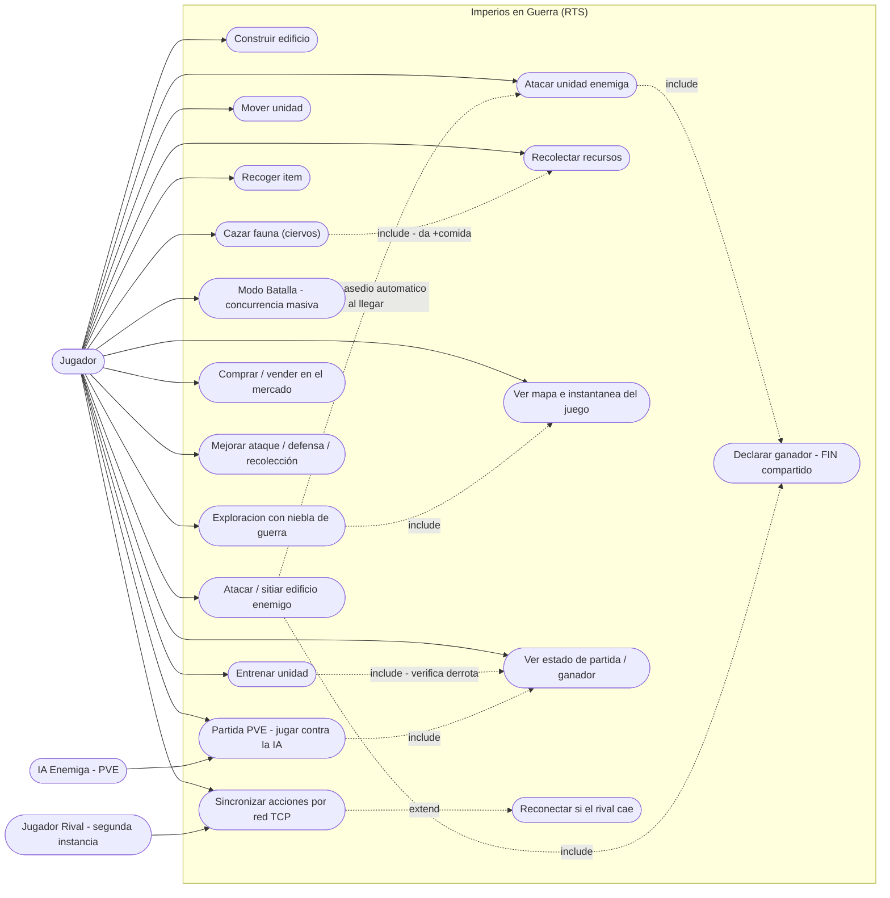
```mermaid
flowchart LR
    J(["Jugador"])
    R(["Jugador Rival - segunda instancia"])
    IA(["IA Enemiga - PVE"])

    subgraph SIS["Imperios en Guerra (RTS)"]
        direction TB
        UC02(["Construir edificio"])
        UC03(["Entrenar unidad"])
        UC05(["Mover unidad"])
        UC06(["Atacar unidad enemiga"])
        UC07(["Atacar / sitiar edificio enemigo"])
        UC08(["Recolectar recursos"])
        UC09(["Recoger item"])
        UC04(["Sincronizar acciones por red TCP"])
        UC11(["Ver mapa e instantanea del juego"])
        UC12(["Ver estado de partida / ganador"])
        UC19(["Declarar ganador - FIN compartido"])
        UC17(["Reconectar si el rival cae"])
        UC18(["Modo Batalla - concurrencia masiva"])
        UC20(["Partida PVE - jugar contra la IA"])
        UC21(["Comprar / vender en el mercado"])
        UC22(["Mejorar ataque / defensa / recolección"])
        UC23(["Exploracion con niebla de guerra"])
        UC24(["Cazar fauna (ciervos)"])
    end

    J --> UC02
    J --> UC03
    J --> UC05
    J --> UC06
    J --> UC07
    J --> UC08
    J --> UC09
    J --> UC11
    J --> UC12
    J --> UC18
    J --> UC04
    J --> UC20
    J --> UC21
    J --> UC22
    J --> UC23
    J --> UC24
    R --> UC04
    IA --> UC20

    UC04 -.->|extend| UC17
    UC03 -.->|include - verifica derrota| UC12
    UC06 -.->|include| UC19
    UC07 -.->|include| UC19
    UC20 -.->|include| UC12
    UC07 -.->|include - asedio automatico al llegar| UC06
    UC23 -.->|include| UC11
    UC24 -.->|include - da +comida| UC08
```

### 2.2 Versión formal PlantUML

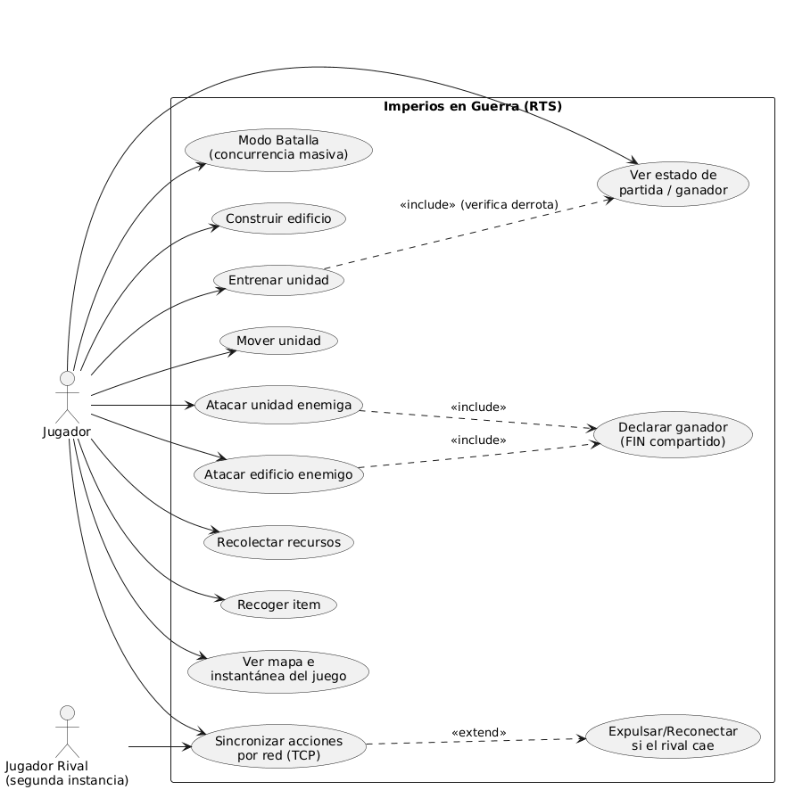

Fuente PlantUML (por si se quiere regenerar):

```text
@startuml
left to right direction
skinparam packageStyle rectangle

actor "Jugador" as J
actor "Jugador Rival\n(segunda instancia)" as R

rectangle "Imperios en Guerra (RTS)" {
  usecase "Construir edificio" as UC02
  usecase "Entrenar unidad" as UC03
  usecase "Mover unidad" as UC05
  usecase "Atacar unidad enemiga" as UC06
  usecase "Atacar edificio enemigo" as UC07
  usecase "Recolectar recursos" as UC08
  usecase "Recoger item" as UC09
  usecase "Sincronizar acciones\npor red (TCP)" as UC04
  usecase "Ver mapa e\ninstantánea del juego" as UC11
  usecase "Ver estado de\npartida / ganador" as UC12
  usecase "Declarar ganador\n(FIN compartido)" as UC19
  usecase "Expulsar/Reconectar\nsi el rival cae" as UC17
  usecase "Modo Batalla\n(concurrencia masiva)" as UC18
}

J --> UC02
J --> UC03
J --> UC05
J --> UC06
J --> UC07
J --> UC08
J --> UC09
J --> UC11
J --> UC12
J --> UC18
J --> UC04
R --> UC04
UC04 ..> UC17 : <<extend>>
UC03 ..> UC12 : <<include>> (verifica derrota)
UC06 ..> UC19 : <<include>>
UC07 ..> UC19 : <<include>>
@enduml
```

---

## 3. Diagramas de secuencia

Formato del protocolo: para que rendericen en cualquier visor, en los diagramas el comando se representa como `NOMBRE (campos)`. En el protocolo real (ver `ConectorRed.cs`) los campos van separados por `;`: `SALUDO;<nombre>`, `MOVER;<ox>;<oy>;<x>;<y>`, `ATACAR;<ax>;<ay>;<bx>;<by>;<dano>`, `ATACAR_EDIFICIO;<ax>;<ay>;<ex>;<ey>;<ataque>`, `CONSTRUIR;<Tipo>;<x>;<y>`, `ENTRENAR;<Tipo>;<x>;<y>`, `RECOLECTAR;<x>;<y>;<1|0>`, `ITEM;<TipoItem>;<x>;<y>`, `RECOGER_ITEM;<TipoItem>;<x>;<y>`, `FIN;<ganador>`, `PING` / `PONG` (latido silencioso anti-tubo-muerto).

> **Nota (aridad).** Cada comando declara su número de campos en el diccionario `Aridad` de `JuegoControlador`. Un mensaje truncado (por una reconexión a medias) se registra como "mal formado" y se descarta, en vez de reventar el `Update()`.

### 3.0 Latido y detección de tubo muerto (PING/PONG)

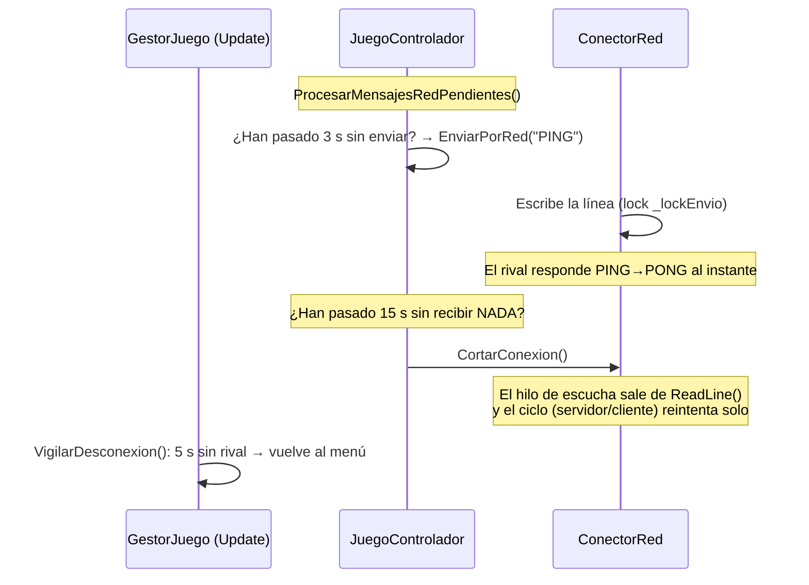
```mermaid
sequenceDiagram
    participant CG as GestorJuego (Update)
    participant C as JuegoControlador
    participant CR as ConectorRed

    Note over C: ProcesarMensajesRedPendientes()
    C->>C: ¿Han pasado 3 s sin enviar? → EnviarPorRed("PING")
    CR->>CR: Escribe la línea (lock _lockEnvio)
    Note over CR: El rival responde PING→PONG al instante

    Note over C: ¿Han pasado 15 s sin recibir NADA?
    C->>CR: CortarConexion()
    Note over CR: El hilo de escucha sale de ReadLine()<br/>y el ciclo (servidor/cliente) reintenta solo
    CG->>CG: VigilarDesconexion(): 5 s sin rival → vuelve al menú
```

**Por qué existe:** una red WiFi puede cortar el tubo "a medias" (sin `FIN`): todo queda callado y el espejo se congela. El latido lo detecta en 15 s sin reiniciar la partida; la reconexión la hace el propio hilo de red.

### 3.7 Mercado y herrería (exclusivos del jugador local)

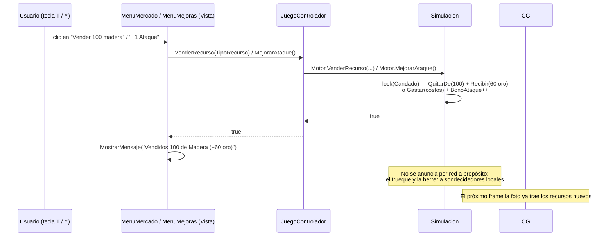
```mermaid
sequenceDiagram
    participant U as Usuario (tecla T / Y)
    participant MM as MenuMercado / MenuMejoras (Vista)
    participant C as JuegoControlador
    participant S as Simulacion

    U->>MM: clic en "Vender 100 madera" / "+1 Ataque"
    MM->>C: VenderRecurso(TipoRecurso) / MejorarAtaque()
    C->>S: Motor.VenderRecurso(...) / Motor.MejorarAtaque()
    S->>S: lock(Candado) — QuitarDe(100) + Recibir(60 oro)<br/>o Gastar(costos) + BonoAtaque++
    S-->>C: true
    C-->>MM: true
    MM->>MM: MostrarMensaje("Vendidos 100 de Madera (+60 oro)")

    Note over S: No se anuncia por red a propósito:<br/>el trueque y la herrería sondecidedores locales
    Note over CG: El próximo frame la foto ya trae los recursos nuevos
```


### 3.1 Mover una unidad y espejarlo en el rival

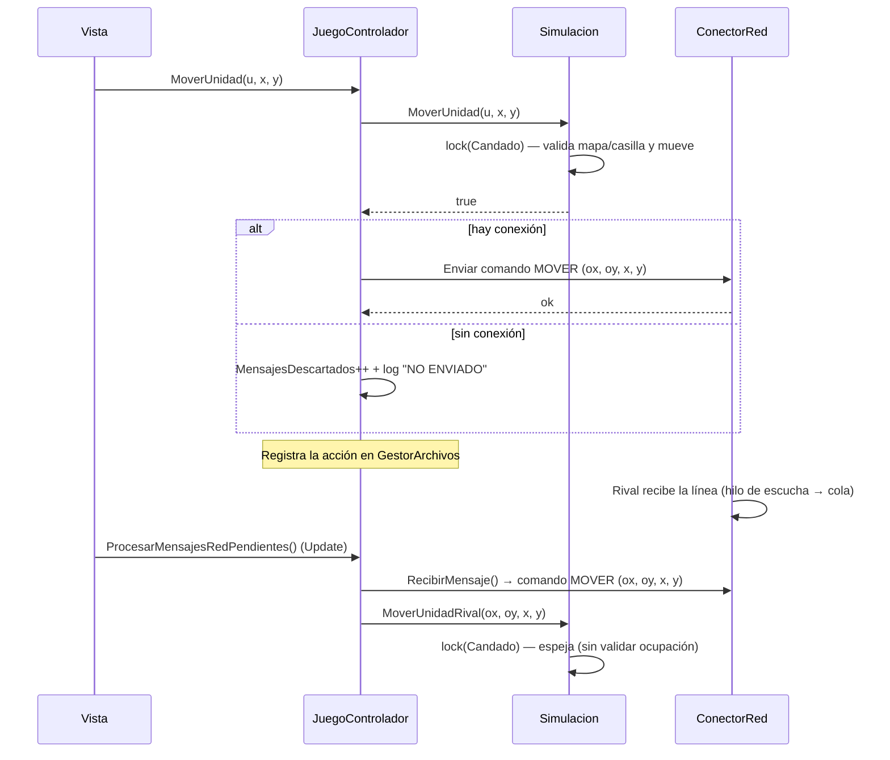
```mermaid
sequenceDiagram
    participant V as Vista
    participant C as JuegoControlador
    participant S as Simulacion
    participant CR as ConectorRed

    V->>C: MoverUnidad(u, x, y)
    C->>S: MoverUnidad(u, x, y)
    S->>S: lock(Candado) — valida mapa/casilla y mueve
    S-->>C: true
    alt hay conexión
        C->>CR: Enviar comando MOVER (ox, oy, x, y)
        CR-->>C: ok
    else sin conexión
        C->>C: MensajesDescartados++ + log "NO ENVIADO"
    end
    Note over C: Registra la acción en GestorArchivos

    CR->>CR: Rival recibe la línea (hilo de escucha → cola)
    V->>C: ProcesarMensajesRedPendientes() (Update)
    C->>CR: RecibirMensaje() → comando MOVER (ox, oy, x, y)
    C->>S: MoverUnidadRival(ox, oy, x, y)
    S->>S: lock(Candado) — espeja (sin validar ocupación)
```

### 3.2 Atacar una unidad: daño calculado una vez, restado en ambas copias

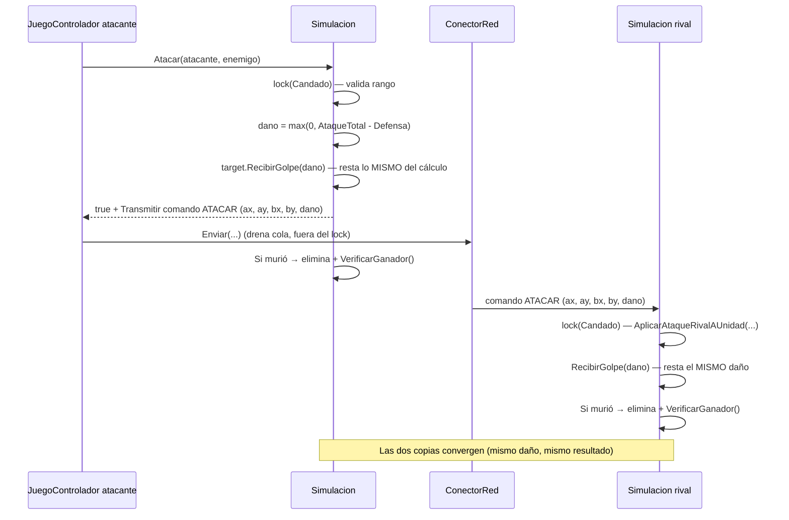
```mermaid
sequenceDiagram
    participant C as JuegoControlador atacante
    participant S as Simulacion
    participant CR as ConectorRed
    participant S2 as Simulacion rival

    C->>S: Atacar(atacante, enemigo)
    S->>S: lock(Candado) — valida rango
    S->>S: dano = max(0, AtaqueTotal - Defensa)
    S->>S: target.RecibirGolpe(dano) — resta lo MISMO del cálculo
    S-->>C: true + Transmitir comando ATACAR (ax, ay, bx, by, dano)
    C->>CR: Enviar(...) (drena cola, fuera del lock)
    S->>S: Si murió → elimina + VerificarGanador()

    CR->>S2: comando ATACAR (ax, ay, bx, by, dano)
    S2->>S2: lock(Candado) — AplicarAtaqueRivalAUnidad(...)
    S2->>S2: RecibirGolpe(dano) — resta el MISMO daño
    S2->>S2: Si murió → elimina + VerificarGanador()
    Note over S,S2: Las dos copias convergen (mismo daño, mismo resultado)
```

### 3.3 Entrenar una unidad en el rival (evento del Modelo)

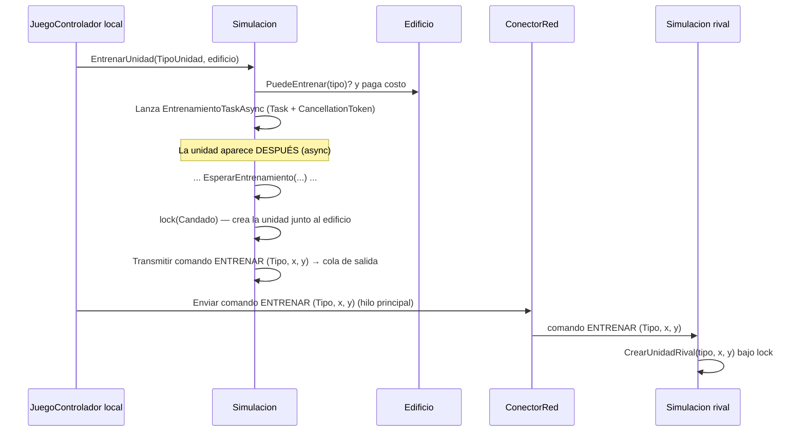
```mermaid
sequenceDiagram
    participant C as JuegoControlador local
    participant S as Simulacion
    participant E as Edificio
    participant CR as ConectorRed
    participant S2 as Simulacion rival

    C->>S: EntrenarUnidad(TipoUnidad, edificio)
    S->>E: PuedeEntrenar(tipo)? y paga costo
    S->>S: Lanza EntrenamientoTaskAsync (Task + CancellationToken)
    Note over S: La unidad aparece DESPUÉS (async)
    S->>S: ... EsperarEntrenamiento(...) ...
    S->>S: lock(Candado) — crea la unidad junto al edificio
    S->>S: Transmitir comando ENTRENAR (Tipo, x, y) → cola de salida
    C->>CR: Enviar comando ENTRENAR (Tipo, x, y) (hilo principal)
    CR->>S2: comando ENTRENAR (Tipo, x, y)
    S2->>S2: CrearUnidadRival(tipo, x, y) bajo lock
```

### 3.4 Sembrar/recoger un item (Casco: efecto temporal con expiración)

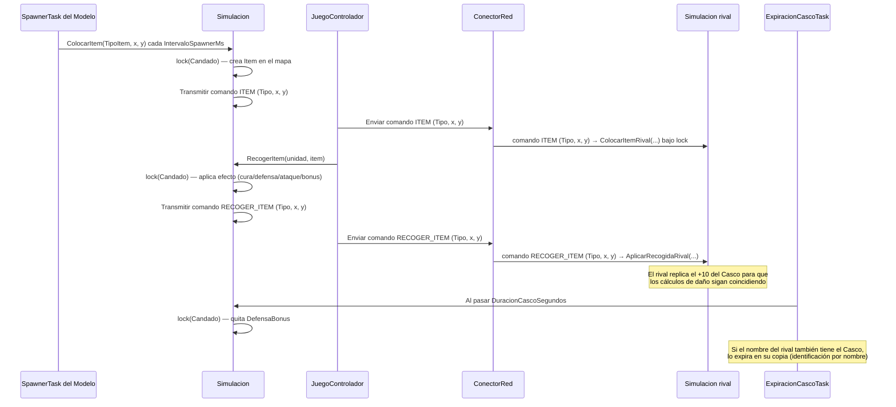
```mermaid
sequenceDiagram
    participant Sp as SpawnerTask del Modelo
    participant S as Simulacion
    participant C as JuegoControlador
    participant CR as ConectorRed
    participant S2 as Simulacion rival
    participant Ex as ExpiracionCascoTask

    Sp->>S: ColocarItem(TipoItem, x, y) cada IntervaloSpawnerMs
    S->>S: lock(Candado) — crea Item en el mapa
    S->>S: Transmitir comando ITEM (Tipo, x, y)
    C->>CR: Enviar comando ITEM (Tipo, x, y)
    CR->>S2: comando ITEM (Tipo, x, y) → ColocarItemRival(...) bajo lock

    C->>S: RecogerItem(unidad, item)
    S->>S: lock(Candado) — aplica efecto (cura/defensa/ataque/bonus)
    S->>S: Transmitir comando RECOGER_ITEM (Tipo, x, y)
    C->>CR: Enviar comando RECOGER_ITEM (Tipo, x, y)
    CR->>S2: comando RECOGER_ITEM (Tipo, x, y) → AplicarRecogidaRival(...)
    Note over S2: El rival replica el +10 del Casco para que<br/>los cálculos de daño sigan coincidiendo

    Ex->>S: Al pasar DuracionCascoSegundos
    S->>S: lock(Candado) — quita DefensaBonus
    Note over Ex: Si el nombre del rival también tiene el Casco,<br/>lo expira en su copia (identificación por nombre)
```

### 3.5 Fin de partida sincronizado (implementado)

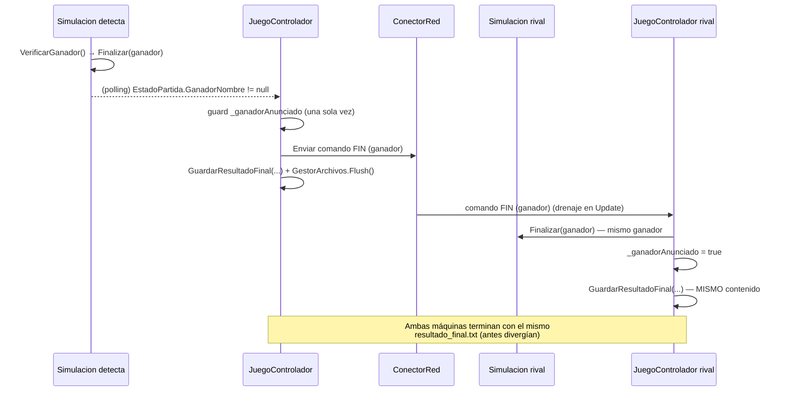
```mermaid
sequenceDiagram
    participant S as Simulacion detecta
    participant C as JuegoControlador
    participant CR as ConectorRed
    participant S2 as Simulacion rival
    participant C2 as JuegoControlador rival

    S->>S: VerificarGanador() → Finalizar(ganador)
    S-->>C: (polling) EstadoPartida.GanadorNombre != null
    C->>C: guard _ganadorAnunciado (una sola vez)
    C->>CR: Enviar comando FIN (ganador)
    C->>C: GuardarResultadoFinal(...) + GestorArchivos.Flush()

    CR->>C2: comando FIN (ganador) (drenaje en Update)
    C2->>S2: Finalizar(ganador) — mismo ganador
    C2->>C2: _ganadorAnunciado = true
    C2->>C2: GuardarResultadoFinal(...) — MISMO contenido
    Note over C,C2: Ambas máquinas terminan con el mismo<br/>resultado_final.txt (antes divergían)
```

### 3.6 Decisión de la IA (PVE) — Task propia, muta bajo lock

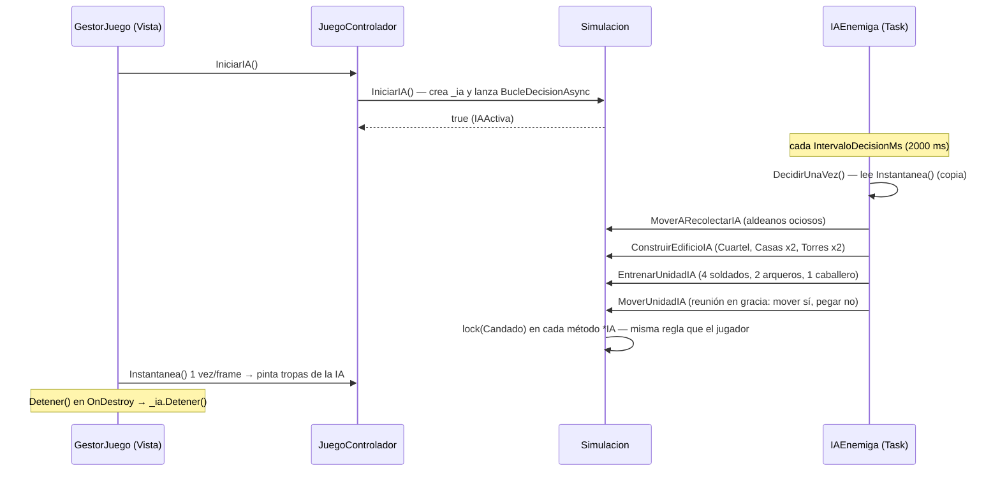
```mermaid
sequenceDiagram
    participant CG as GestorJuego (Vista)
    participant C as JuegoControlador
    participant S as Simulacion
    participant IA as IAEnemiga (Task)

    CG->>C: IniciarIA()
    C->>S: IniciarIA() — crea _ia y lanza BucleDecisionAsync
    S-->>C: true (IAActiva)
    Note over IA: cada IntervaloDecisionMs (2000 ms)
    IA->>IA: DecidirUnaVez() — lee Instantanea() (copia)
    IA->>S: MoverARecolectarIA (aldeanos ociosos)
    IA->>S: ConstruirEdificioIA (Cuartel, Casas x2, Torres x2)
    IA->>S: EntrenarUnidadIA (4 soldados, 2 arqueros, 1 caballero)
    IA->>S: MoverUnidadIA (reunión en gracia: mover sí, pegar no)
    S->>S: lock(Candado) en cada método *IA — misma regla que el jugador
    CG->>C: Instantanea() 1 vez/frame → pinta tropas de la IA
    Note over CG: Detener() en OnDestroy → _ia.Detener()
```

### 3.8 El frame completo: Vista ↔ Controlador ↔ Modelo

Este es el ciclo que se repite ~60 veces por segundo. Muestra **exactamente** dónde está cada intercambio:

```mermaid
sequenceDiagram
    autonumber
    participant U as Usuario
    participant IN as ControlInputUsuario (Vista)
    participant GJ as GestorJuego (Vista)
    participant C as JuegoControlador
    participant S as Simulacion (Modelo)
    participant CR as ConectorRed (Modelo)
    participant T as Hud / VistaTablero / Minimap (Vista)

    Note over GJ: === Update() en el HILO PRINCIPAL de Unity ===
    GJ->>C: ProcesarMensajesRedPendientes()  (intercambio 2)
    C->>C: drena _salientes (Modelo hacia red)
    C->>CR: Enviar(...)  (FUERA de lock)
    C->>C: RecibirMensaje() -> ProcesarMensajeRed(mensaje)
    C->>S: Motor.MoverUnidadRival(...) / AplicarAtaqueRival...
    S->>S: lock(Candado) - aplica el espejo
    C->>C: si GanadorNombre != null, envia FIN (una sola vez)

    GJ->>C: Instantanea()  (intercambio 2)
    C->>S: Motor.Instantanea()
    S->>S: lock(Candado) - COPIA listas y recursos
    S-->>C: InstantaneaJuego
    C-->>GJ: UltimaFoto
    GJ->>T: Actualizar(UltimaFoto)  (intercambio A: pintar)
    T->>T: dibuja sprites, HUD, minimapa (solo COPIAS)

    Note over U,S: === Cuando el usuario hace clic ===
    U->>IN: clic en el mapa
    IN->>IN: celda desde raycast, busca en UltimaFoto
    IN->>C: MoverUnidad / ConstruirEdificio / Atacar / Entrenar  (intercambio 3)
    C->>S: Motor.MoverUnidad(...)  (Controlador hacia Modelo)
    S->>S: lock(Candado) - valida y muta
    S-->>C: true
    C->>C: EnviarPorRed("MOVER;...")  (cola, no bloqueante)
    C-->>IN: true
    IN->>GJ: MostrarMensaje("Caminando a...") o AccionRechazada(...)
```

**Puntos clave del frame:**

1. `ProcesarMensajesRedPendientes()` va **antes** de `Instantanea()` — si se invirtiera, la Vista dibujaría un frame viejo.
2. `Instantanea()` se llama **una sola vez**; los 5 componentes de dibujo reciben **la misma copia**.
3. Los clics del usuario se resuelven contra `UltimaFoto` (copia), pero se ejecutan contra el **Modelo vivo** vía el Controlador.
4. El Controlador devuelve `bool` a la Vista: `true` = aceptó, `false` = la Vista muestra "No se pudo: ...".

---

## 4. Mapa de concurrencia

Todos los hilos, locks y colas viven en el **Modelo** (regla de la materia). El Controlador solo consume en el hilo principal.


```mermaid
flowchart TB
    subgraph HILO_PRINCIPAL["Hilo principal (Unity) — Update()"]
        V["Vista.refrescar()"]
        PC["JuegoControlador.ProcesarMensajesRedPendientes()"]
        EN["JuegoControlador.EnviarPorRed() (drena cola)"]
    end

    subgraph MODELO["Modelo — Simulacion"]
        LOCK{{"lock(Candado)\nLock del mundo"}}
        T1["Task: Reloj (IniciarRelojAsync)\n1 s -> TiempoJuegoSegundos++"]
        T2["Task: Bucle de simulacion\n(AvanzarDestinos + ResolverTick)"]
        T3["Task: Spawner de items (solo host)"]
        T4["Task: Fauna (VagarFaunaAsync)\nciervos dan pasos al azar"]
        T5["Task: Economia pasiva\nCasas->comida, Centros->oro (4 s)"]
        T6["Task: Entrenamiento\n(1 por unidad en cola)"]
        T7["Task: Construccion\n(1 por obra en curso)"]
        T8["Task: Recoleccion\n(1 por aldeano trabajando)"]
        T9["Task: Expiracion del Casco\nquita DefensaBonus a los X s"]
        T10["Task: IA Enemiga\n(BucleDecisionAsync, PVE)"]
        COLA_OUT["ConcurrentQueue _salientes\n(productor-consumidor)"]
    end

    subgraph ARCHIVOS["Modelo — GestorArchivos"]
        HILO_LOG["Thread 'HiloEscritorLogs' (IsBackground)"]
        COLA_LOG["BlockingCollection (cola de escritura)"]
    end

    subgraph RED["Modelo — ConectorRed"]
        HILO_RED["Thread 'HiloRedServidor' / 'HiloRedCliente' (IsBackground)"]
        COLA_IN["ConcurrentQueue _recibidos"]
        LOCK_ENV{{"lock(_lockEnvio)"}}
    end

    T1 & T2 & T3 & T4 & T5 & T6 & T7 & T8 & T9 & T10 -->|"mutan estado"| LOCK
    T1 & T2 & T3 & T4 & T5 & T6 & T7 & T8 & T9 -->|"Transmitir()"| COLA_OUT
    COLA_OUT -->|"SiguienteSaliente()"| EN
    EN -->|"Enviar()"| LOCK_ENV
    HILO_RED -->|"ReadLine() bloqueante"| COLA_IN
    HILO_RED -.->|"Enviar()"| LOCK_ENV
    COLA_IN -->|"RecibirMensaje()"| PC
    PC -->|"metodos espejo *Rival"| LOCK
    V -->|"Instantanea() copia bajo lock"| LOCK
    T1 & T2 & T3 & T4 & T5 & T6 & T7 & T8 & T9 & T10 -.->|"RegistrarAccion()"| COLA_LOG
    COLA_LOG --> HILO_LOG -->|"escribe a disco"| DISCO[(configuracion / log / resultado)]

    style LOCK fill:#ffe6e6,stroke:#cc0000
    style LOCK_ENV fill:#ffe6e6,stroke:#cc0000
    style COLA_OUT fill:#e6f2ff
    style COLA_IN fill:#e6f2ff
    style COLA_LOG fill:#e6f2ff
```

**Resumen numérico**

| Elemento | Cantidad | Detalle |
|---|---|---|
| Tipos de Task del Modelo | **10** | reloj, bucle de simulación, spawner de items, fauna, economía pasiva, entrenamiento, construcción, recolección, expiración del Casco, **IA enemiga (PVE)** |
| Tasks vivas a la vez | variable | 4 fijas (reloj, bucle, fauna, economía) + 1 si es host (spawner) + 1 por entrenamiento/obra/aldeano/casco + 1 si hay IA |
| Hilos (`Thread`) | **2** | escucha TCP (`ConectorRed`) + escritor de logs (`GestorArchivos`) |
| Candados (`lock`) | **3** | `Simulacion.Candado`, `ConectorRed._lockEnvio`, candado interno del `BlockingCollection` de `GestorArchivos` |
| Colas seguras | **3** | `_salientes`, `_recibidos`, cola de escritura de logs |
| `CancellationTokenSource` | **6 + n** | reloj, spawner, economía, simulación, efectos temporales, fauna (fijos) + 1 por entrenamiento/obra/recolección en curso |

**Puntos clave para la defensa**

1. **Nadie escribe a un socket ni a disco dentro de `lock(Candado)`.** El Modelo **encola** (`_salientes`) y el Controlador envía desde el hilo principal; los logs se encolan y los escribe un único hilo.
2. **La Vista nunca toca las listas vivas:** pide `Instantanea()` una vez por frame (copia bajo candado) y dibuja sobre copias.
3. **Reconexión:** los bucles `CicloServidor`/`CicloCliente` vuelven a aceptar/reintentar; `AlConectar` reenvía el `SALUDO`.
4. **Tubo muerto:** `PING`/`PONG` y corte a los 15 s sin recibir nada → el hilo de red reconecta solo, sin reiniciar la partida.
5. **Batalla Nivel 1:** un solo hilo dentro del candado (sin carreras). El Nivel 2 (`Parallel.For`) queda como optimización futura.
6. **`Detener()` usa `CancellationTokenSource`:** los 6 CTS del motor se cancelan; los trabajos en curso se fotografían **bajo candado** y se cancelan **fuera** (evita reentrada al iterar los diccionarios).

---

## 5. Anexo — Arquitectura de la Vista

La Vista no calcula reglas; solo dibuja y delega. Son **12 MonoBehaviours**, todos colgando de `GestorJuego`:

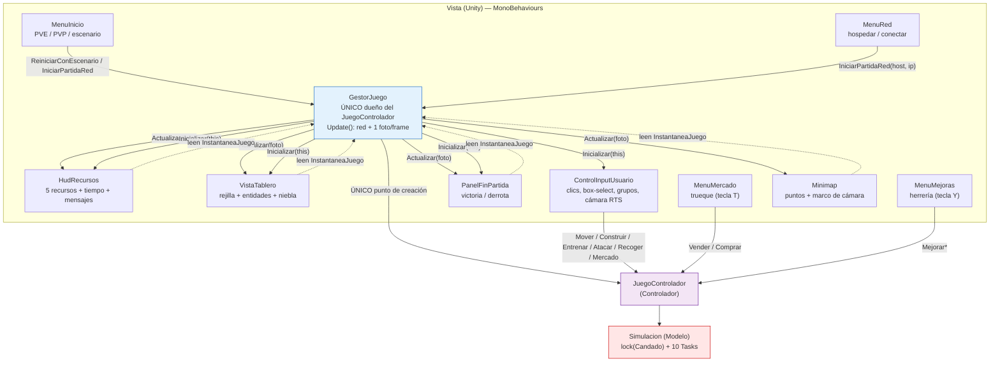
```mermaid
flowchart TB
    subgraph VISTA["Vista (Unity) — MonoBehaviours"]
        direction TB
        GJ["GestorJuego\nÚNICO dueño del JuegoControlador\nUpdate(): red + 1 foto/frame"]
        HUD["HudRecursos\n5 recursos + tiempo + mensajes"]
        TILES["VistaTablero\nrejilla + entidades + niebla"]
        IN["ControlInputUsuario\nclics, box-select, grupos, cámara RTS"]
        FIN["PanelFinPartida\nvictoria / derrota"]
        MENU["MenuInicio\nPVE / PVP / escenario"]
        RED["MenuRed\nhospedar / conectar"]
        MERC["MenuMercado\ntrueque (tecla T)"]
        MEJ["MenuMejoras\nherrería (tecla Y)"]
        MINI["Minimap\npuntos + marco de cámara"]
    end

    JC["JuegoControlador\n(Controlador)"]
    MOTOR["Simulacion (Modelo)\nlock(Candado) + 10 Tasks"]

    GJ -->|"ÚNICO punto de creación"| JC
    GJ -->|"Actualizar(foto)"| HUD & TILES & FIN & MINI
    GJ -->|"Inicializar(this)"| HUD & TILES & IN & FIN
    MENU -->|"ReiniciarConEscenario / IniciarPartidaRed"| GJ
    RED -->|"IniciarPartidaRed(host, ip)"| GJ
    IN -->|"Mover / Construir / Entrenar / Atacar / Recoger / Mercado"| JC
    MERC -->|"Vender / Comprar"| JC
    MEJ -->|"Mejorar*"| JC
    HUD & TILES & FIN & MINI -.->|"leen InstantaneaJuego"| GJ
    JC --> MOTOR

    style JC fill:#f3e5f5,stroke:#6a1b9a
    style MOTOR fill:#ffe6e6,stroke:#cc0000
    style GJ fill:#e3f2fd,stroke:#1565c0
```

**Contrato de la Vista (reglas que no se rompen):**
- `Instantanea()` se llama **una sola vez por `Update()`** y los 12 componentes dibujan desde esa misma copia.
- `ProcesarMensajesRedPendientes()` se llama en `Update()` **antes** de la instantánea (si no, se pinta un frame tarde).
- `Detener()` se llama en `OnDestroy` / `OnApplicationQuit` (apaga el motor, cierra la red y hace `Flush` de logs).
- `MensajesDescartados` se muestra en el HUD: si crece, la conexión se cayó (aviso temprano de desync).
- Ningún componente de Vista crea `Task`/`Thread`/`lock`. Toda la concurrencia está en el Modelo.
- `GestorJuego` es el **único** que instancia `JuegoControlador`; el resto lo recibe por `Inicializar(this)`.
- La UI se construye por código en `ConstruirUiSiFalta()` si la escena no la trae enlazada; la escena mínima es `Assets/Escenas/Juego.unity`.
- Los sprites se cargan de `Assets/Resources/Sprites` con `ArteRecursos`; si falta alguno, `SpriteFactory` genera pixel-art 16×16 por código (fallback, el juego no se rompe).

### 5.1 Los 5 puntos exactos de intercambio Vista ↔ Controlador

Estos son los **únicos** lugares donde la Vista cruza la frontera hacia el Controlador:

| # | Punto | Archivo: línea aprox. | Qué hace | Dirección |
|---|-------|----------------------|----------|-----------|
| **1** | Creación del Controlador | `GestorJuego.Awake()` (l. 79) | `Controlador = new JuegoControlador(nombreJugador, localArriba)` | Vista → Controlador |
| **2** | Drenado de red + foto (cada frame) | `GestorJuego.Update()` (l. 112-113) | `ProcesarMensajesRedPendientes()` y `Instantanea()` | Vista → Controlador |
| **3** | Órdenes del jugador | `ControlInputUsuario` (l. 399, 473, 494, 520, 555, 578, 603, 638, 706, 1224) | `ConstruirEdificio`, `MoverUnidad`, `MoverAAtacar`, `MoverAAtacarEdificio`, `MoverARecolectar`, `MoverARecogerItem`, `EntrenarUnidad`, `CancelarDestino` | Vista → Controlador |
| **4** | Menús (mercado / herrería / red) | `MenuMercado` (l. 52, 60), `MenuMejoras` (l. 51), `MenuRed` + `MenuInicio` → `GestorJuego` | `VenderRecurso`, `ComprarRecurso`, `Mejorar*`, `IniciarPartidaRed` | Vista → Controlador |
| **5** | Apagado del motor | `GestorJuego.OnDestroy()` (l. 186) | `Controlador.Detener()` (cancela Tasks, cierra red, `Flush` de logs) | Vista → Controlador |

Y solo **dos** caminos de regreso (Controlador/Vista nunca se llama entre sí, no hay retroalimentación):

| # | Punto | Mecanismo | Dirección |
|---|-------|-----------|-----------|
| **A** | Pintar el mundo | `UltimaFoto` (`InstantaneaJuego`), copia inmutable creada bajo `lock(Candado)` | Controlador/Modelo → Vista |
| **B** | Mensajes al usuario | `GestorJuego.MostrarMensaje()` / `AccionRechazada()` (la Vista se llama a sí misma) | Vista → Vista |

**No hay más.** En concreto, el Controlador **nunca** toca un `Transform`, un `SpriteRenderer` ni un `Text`; y la Vista **nunca** llama a `Motor` para mutar el mundo (solo el Controlador lo hace, y solo con métodos que el Modelo ya serializa bajo su candado).

---

## 6. Diagrama de flujo del juego

### 6.1 Flujo general del juego

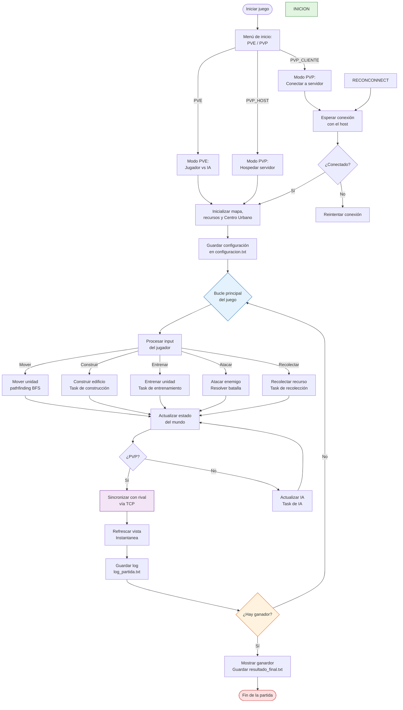
```mermaid
flowchart TD
    INICIO([Iniciar juego]) --> MENU[Menú de inicio:\nPVE / PVP]
    MENU -->|PVE| PVE[Modo PVE:\nJugador vs IA]
    MENU -->|PVP_HOST| HOST[Modo PVP:\nHospedar servidor]
    MENU -->|PVP_CLIENTE| CLIENTE[Modo PVP:\nConectar a servidor]
    
    PVE --> INIT[Inicializar mapa,\nrecursos y Centro Urbano]
    HOST --> INIT
    CLIENTE --> ESPERAR[Esperar conexión\ncon el host]
    ESPERAR --> CONECTADO{¿Conectado?}
    CONECTADO -->|No| RECONNECT[Reintentar conexión]
    RECONCONNECT --> ESPERAR
    CONECTADO -->|Sí| INIT
    
    INIT --> GUARDAR[Guardar configuración\nen configuracion.txt]
    GUARDAR --> BUCLE{Bucle principal\ndel juego}
    
    BUCLE --> INPUT[Procesar input\ndel jugador]
    INPUT -->|Mover| MOVER[Mover unidad\npathfinding BFS]
    INPUT -->|Construir| CONSTRUIR[Construir edificio\nTask de construcción]
    INPUT -->|Entrenar| ENTRENAR[Entrenar unidad\nTask de entrenamiento]
    INPUT -->|Atacar| ATACAR[Atacar enemigo\nResolver batalla]
    INPUT -->|Recolectar| RECOLECTAR[Recolectar recurso\nTask de recolección]
    
    MOVER --> UPDATE[Actualizar estado\ndel mundo]
    CONSTRUIR --> UPDATE
    ENTRENAR --> UPDATE
    ATACAR --> UPDATE
    RECOLECTAR --> UPDATE
    
    UPDATE --> RED{¿PVP?}
    RED -->|Sí| SYNC[Sincronizar con rival\nvía TCP]
    RED -->|No| IA_UPDATE[Actualizar IA\nTask de IA]
    IA_UPDATE --> UPDATE
    SYNC --> DRAW[Refrescar vista\nInstantanea]
    DRAW --> SAVE[Guardar log\nlog_partida.txt]
    SAVE --> VICTORIA{¿Hay ganador?}
    VICTORIA -->|No| BUCLE
    VICTORIA -->|Sí| FIN[Mostrar ganardor\nGuardar resultado_final.txt]
    FIN --> FINPARTIDA([Fin de la partida])
    
    style INICION fill:#e1f5e1,stroke:#2e7d32
    style FINPARTIDA fill:#ffe1e1,stroke:#c62828
    style BUCLE fill:#e3f2fd,stroke:#1565c0
    style VICTORIA fill:#fff3e0,stroke:#e65100
    style SYNC fill:#f3e5f5,stroke:#6a1b9a
```

### 6.2 Flujo de verificación de ganador

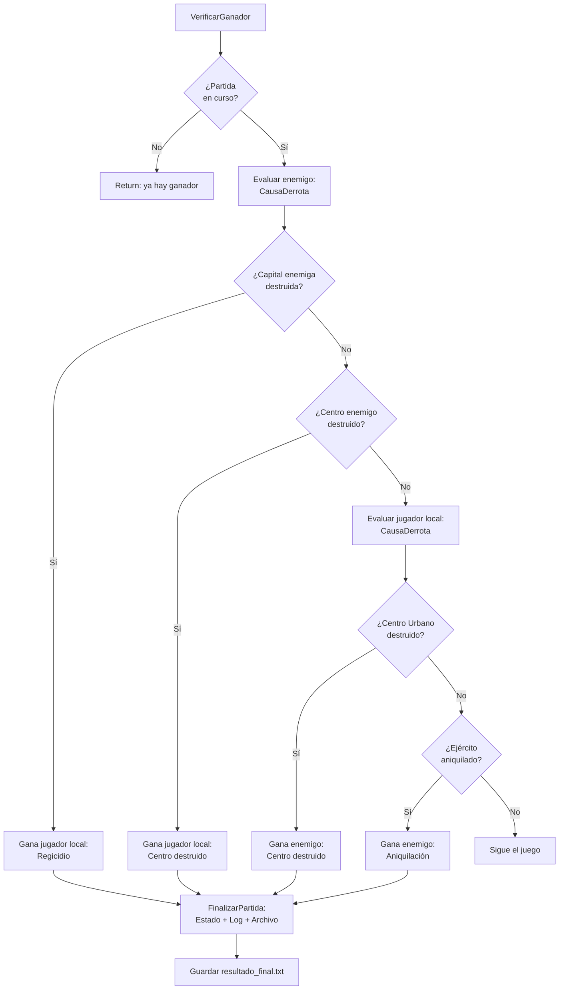
```mermaid
flowchart TD
    A[VerificarGanador] --> B{¿Partida\nen curso?}
    B -->|No| Z[Return: ya hay ganador]
    B -->|Sí| C[Evaluar enemigo:\nCausaDerrota]
    C --> D{¿Capital enemiga\ndestruida?}
    D -->|Sí| W1[Gana jugador local:\nRegicidio]
    D -->|No| E{¿Centro enemigo\ndestruido?}
    E -->|Sí| W2[Gana jugador local:\nCentro destruido]
    E -->|No| F[Evaluar jugador local:\nCausaDerrota]
    F --> G{¿Centro Urbano\ndestruido?}
    G -->|Sí| W3[Gana enemigo:\nCentro destruido]
    G -->|No| H{¿Ejército\naniquilado?}
    H -->|Sí| W4[Gana enemigo:\nAniquilación]
    H -->|No| I[Sigue el juego]
    
    W1 --> J[FinalizarPartida:\nEstado + Log + Archivo]
    W2 --> J
    W3 --> J
    W4 --> J
    J --> K[Guardar resultado_final.txt]
```

### 6.3 Flujo de concurrencia (Tasks y Locks)

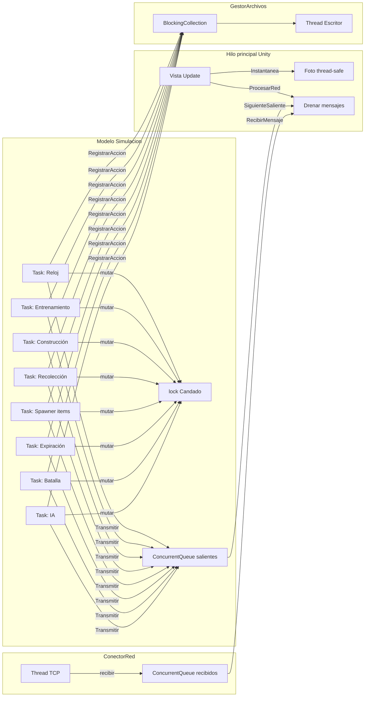
```mermaid
flowchart LR
    subgraph HILO_PRINCIPAL[Hilo principal Unity]
        V[Vista Update] -->|Instantanea| FOTO[Foto thread-safe]
        V -->|ProcesarRed| DRENAR[Drenar mensajes]
    end
    
    subgraph MODELO[Modelo Simulacion]
        LOCK[lock Candado]
        T1[Task: Reloj]
        T2[Task: Entrenamiento]
        T3[Task: Construcción]
        T4[Task: Recolección]
        T5[Task: Spawner items]
        T6[Task: Expiración]
        T7[Task: Batalla]
        T8[Task: IA]
        COLA_OUT[ConcurrentQueue salientes]
    end
    
    subgraph RED[ConectorRed]
        TCP[Thread TCP]
        COLA_IN[ConcurrentQueue recibidos]
    end
    
    subgraph ARCHIVOS[GestorArchivos]
        LOG[Thread Escritor]
        COLA_LOG[BlockingCollection]
    end
    
    T1 & T2 & T3 & T4 & T5 & T6 & T7 & T8 -->|mutar| LOCK
    T1 & T2 & T3 & T4 & T5 & T6 & T7 & T8 -->|Transmitir| COLA_OUT
    COLA_OUT -->|SiguienteSaliente| DRENAR
    TCP -->|recibir| COLA_IN
    COLA_IN -->|RecibirMensaje| DRENAR
    T1 & T2 & T3 & T4 & T5 & T6 & T7 & T8 -->|RegistrarAccion| COLA_LOG
    COLA_LOG --> LOG
```

### 6.4 Flujo de comunicación en red

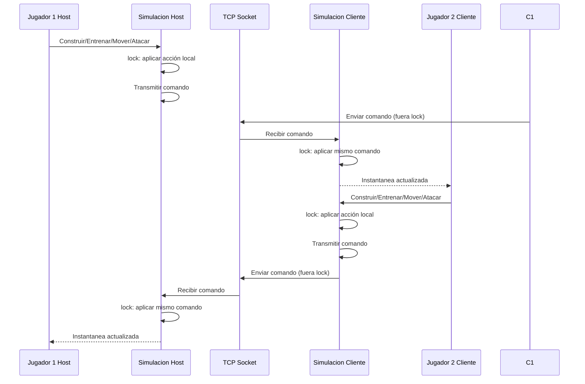
```mermaid
sequenceDiagram
    participant J1 as Jugador 1 Host
    participant S1 as Simulacion Host
    participant TCP as TCP Socket
    participant S2 as Simulacion Cliente
    participant J2 as Jugador 2 Cliente

    J1->>S1: Construir/Entrenar/Mover/Atacar
    S1->>S1: lock: aplicar acción local
    S1->>S1: Transmitir comando
    C1->>TCP: Enviar comando (fuera lock)
    TCP->>S2: Recibir comando
    S2->>S2: lock: aplicar mismo comando
    S2-->>J2: Instantanea actualizada
    J2->>S2: Construir/Entrenar/Mover/Atacar
    S2->>S2: lock: aplicar acción local
    S2->>S2: Transmitir comando
    S2->>TCP: Enviar comando (fuera lock)
    TCP->>S1: Recibir comando
    S1->>S1: lock: aplicar mismo comando
    S1-->>J1: Instantanea actualizada
```

**Justificación del diseño:**
1. **Regla de oro:** NUNCA se escribe a un socket ni a disco dentro de `lock(Candado)`. Las Tasks solo encolan; el Controlador envía desde el hilo principal.
2. **Vista tonta:** Solo lee `Instantanea()` (una copia segura) y dibuja. Nunca toca listas vivas.
3. **Convergencia:** Ambos jugadores ejecutan la MISMA fórmula de daño → mismo resultado sin enviar estado completo.
4. **Reconexión:** Si la red cae, `ConectorRed` reintenta cada 1 segundo sin bloquear el juego.
5. **Logs asíncronos:** `GestorArchivos` usa productor-consumidor para que la escritura a disco nunca frene la simulación.

### 6.5 Flujo de demolición (clic en edificio enemigo)

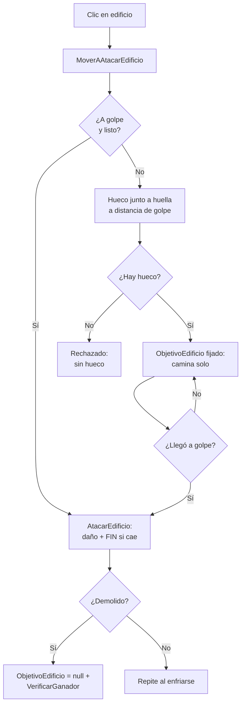
```mermaid
flowchart TD
    A[Clic en edificio] --> B[MoverAAtacarEdificio]
    B --> C{¿A golpe\ny listo?}
    C -->|Sí| D[AtacarEdificio:\ndaño + FIN si cae]
    C -->|No| E[Hueco junto a huella\na distancia de golpe]
    E --> F{¿Hay hueco?}
    F -->|No| Z[Rechazado:\nsin hueco]
    F -->|Sí| G[ObjetivoEdificio fijado:\ncamina solo]
    G --> H{¿Llegó a golpe?}
    H -->|Sí| D
    H -->|No| G
    D --> I{¿Demolido?}
    I -->|Sí| J[ObjetivoEdificio = null +\nVerificarGanador]
    I -->|No| K[Repite al enfriarse]
```

Solo otra orden del jugador (mover, Esc, recolectar, otro ataque) suelta el
asedio. Las esquinas diagonales no valen como hueco (quedan a distancia 2).

### 6.6 FFA por bandos y niebla de exploración

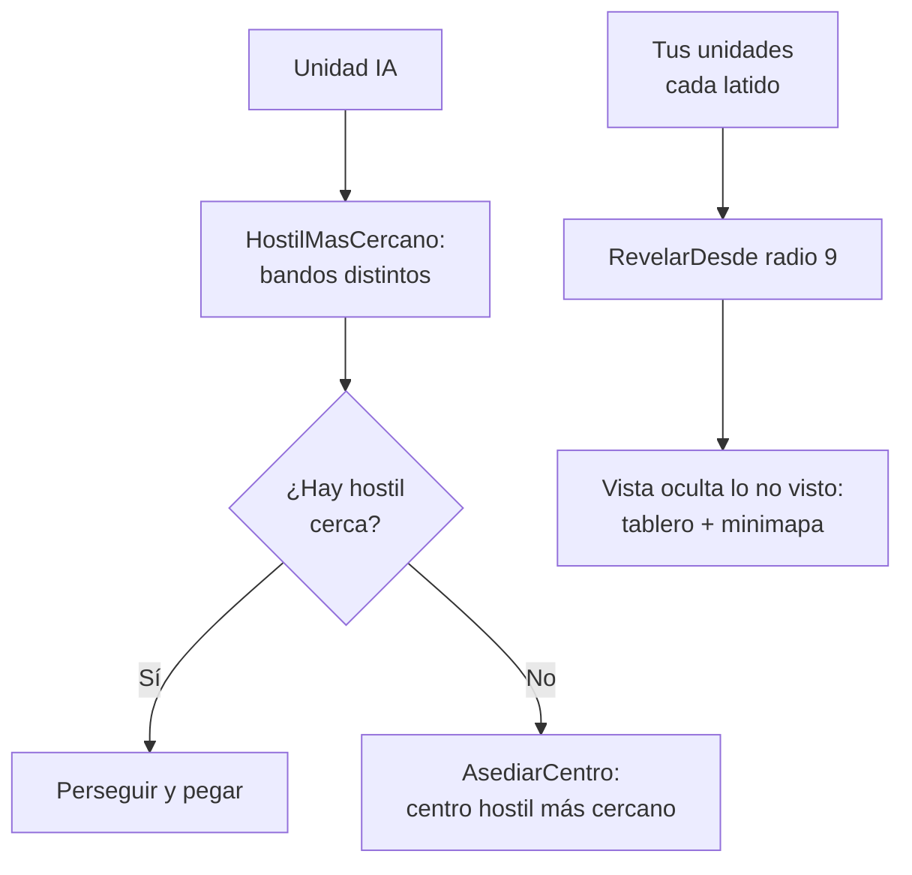
```mermaid
flowchart TD
    A[Unidad IA] --> B[HostilMasCercano:\nbandos distintos]
    B --> C{¿Hay hostil\ncerca?}
    C -->|Sí| D[Perseguir y pegar]
    C -->|No| E[AsediarCentro:\ncentro hostil más cercano]
    F[Tus unidades\ncada latido] --> G[RevelarDesde radio 9]
    G --> H[Vista oculta lo no visto:\ntablero + minimapa]
```

- **Bandos:** 0 = jugador, 1..5 = aldeas enemigas. Entrenar hereda el bando
  del edificio; construir, el del centro más cercano. Sin eliminación de
  bandos (v1): pelean y se debilitan, pero solo el jugador gana/pierde.
- **Niebla (modo exploración):** `_visto[,]` en el Modelo, `EsVisible(x,y)`
  para la Vista. La capital enemiga sale en puesto aleatorio (manhattan
  ≥ 70 de tu base). Ganar = destruirla sin saber dónde está.
